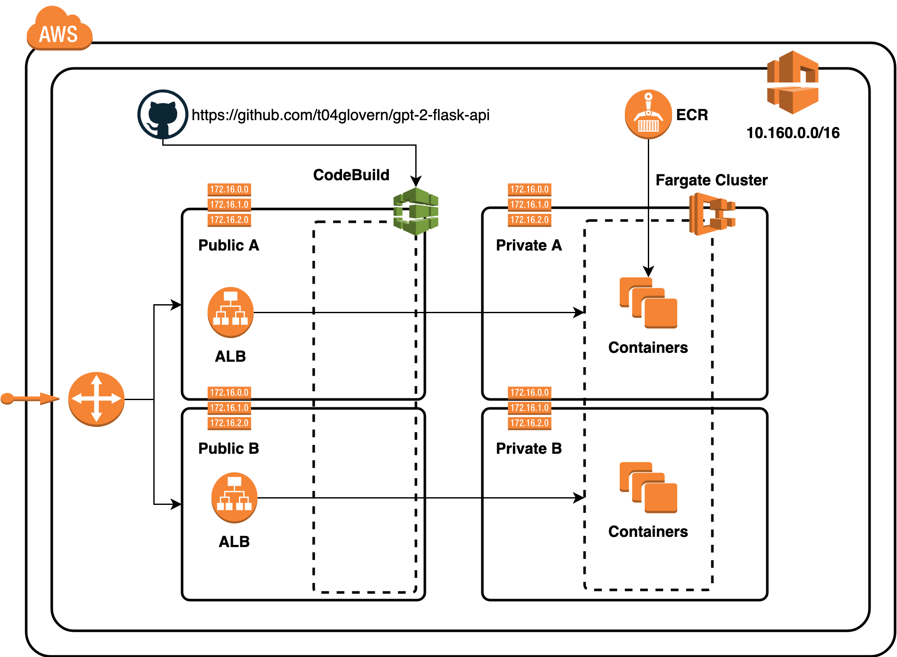

# GPT-2 Flask API

Containerising PyTorch models in a repeatable way. Deploy OpenAI's GPT-2 model and expose it over a Flask API. Finally deploy it to AWS Fargate container hosting using CloudFormation.



First, before anything else download the model

```bash
mkdir models
curl --output models/gpt2-pytorch_model.bin https://s3.amazonaws.com/models.huggingface.co/bert/gpt2-pytorch_model.bin
```

---

## Local

---

Run the following to get started with your local python environment

```bash
python3 -m venv ./venv
source venv/bin/activate
pip install --upgrade pip
pip install -r requirements.txt
```

Then run the python flask server using the following

```bash
cd deployment
python run_server.py
```

### docker-compose

#### Setup

```bash
docker-compose up --build flask
```

Go to [http://localhost:5000](http://localhost:5000)

#### Shutdown

```bash
docker-compose down -v
```

---

## AWS

---

First build and push the container to ECR

```bash
./container_push.sh
```

Setup the CloudFormation stack

```bash
./cloudformation_deploy.sh
```

Deploy the stack

```bash
aws cloudformation create-stack \
    --stack-name "gpt-2-flask" \
    --template-body file://cloudformation/deployment.yaml \
    --parameters file://cloudformation/deployment-params.json \
    --capabilities CAPABILITY_IAM
```

---

## Attribution

---

- [WillKoehrsen/recurrent-neural-networks](https://github.com/WillKoehrsen/recurrent-neural-networks)
- [graykode/gpt-2-Pytorch](https://github.com/graykode/gpt-2-Pytorch)
- [Deploying a Keras Deep Learning Model as a Web Application in Python](https://morioh.com/p/bbbc75c00f96/deploying-a-keras-deep-learning-model-as-a-web-application-in-python)
